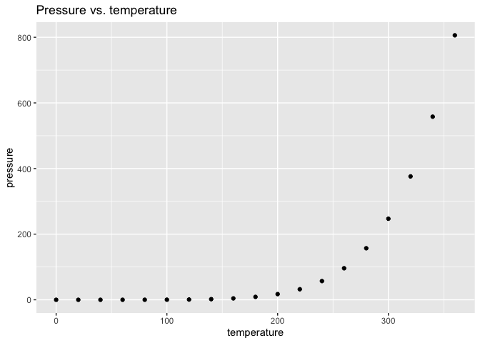

PS07 - GitHub Test
================

## Modified this header

This is an R Markdown format used for publishing markdown documents to
GitHub. When you click the **Knit** button all R code chunks are run and
a markdown file (.md) suitable for publishing to GitHub is generated.

## Example Code with ggplot2

``` r
library(dplyr)
```

    ## 
    ## Attaching package: 'dplyr'

    ## The following objects are masked from 'package:stats':
    ## 
    ##     filter, lag

    ## The following objects are masked from 'package:base':
    ## 
    ##     intersect, setdiff, setequal, union

You can include R code in the document as follows:

``` r
cars <- cars %>% 
  mutate(origin = ifelse((speed*dist >= 300), "Canada", "Mexico")) %>% 
  mutate(year_recorded = 1920)
summary(cars)
```

    ##      speed           dist           origin          year_recorded 
    ##  Min.   : 4.0   Min.   :  2.00   Length:50          Min.   :1920  
    ##  1st Qu.:12.0   1st Qu.: 26.00   Class :character   1st Qu.:1920  
    ##  Median :15.0   Median : 36.00   Mode  :character   Median :1920  
    ##  Mean   :15.4   Mean   : 42.98                      Mean   :1920  
    ##  3rd Qu.:19.0   3rd Qu.: 56.00                      3rd Qu.:1920  
    ##  Max.   :25.0   Max.   :120.00                      Max.   :1920

``` r
glimpse(cars)
```

    ## Rows: 50
    ## Columns: 4
    ## $ speed         <dbl> 4, 4, 7, 7, 8, 9, 10, 10, 10, 11, 11, 12, 12, 12, 12, 13…
    ## $ dist          <dbl> 2, 10, 4, 22, 16, 10, 18, 26, 34, 17, 28, 14, 20, 24, 28…
    ## $ origin        <chr> "Mexico", "Mexico", "Mexico", "Mexico", "Mexico", "Mexic…
    ## $ year_recorded <dbl> 1920, 1920, 1920, 1920, 1920, 1920, 1920, 1920, 1920, 19…

## Example Plot

You can also embed plots, for example:

<!-- -->

Note that the `echo = FALSE` parameter was added to the code chunk to
prevent printing of the R code that generated the plot.
